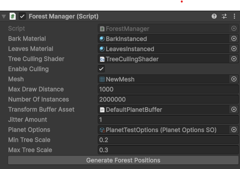
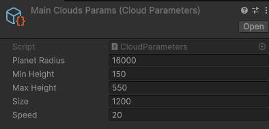
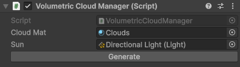
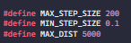
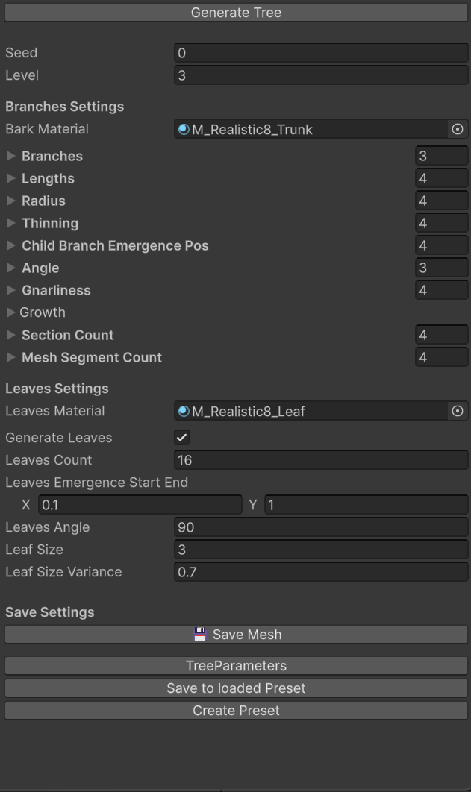

# World Generation

This section will explain the various things needed to generate the shape of the world and render it in an semi-optimized manner. This includes the separation between land and sea, the coast lines as well as the different land biomes. As a bonus, we also added the trees on the planet as well as a fake sea.

## Handling Level of Detail for the planet

To handle the level of detail of the planet, we used a quadtree structure. Each face of the cube that makes the base of the planet is subdivided into 4 parts when the camera is close enough to it. This allows us to have a high level of detail when close to the ground, and a low level of detail when far away from it as shown in the image below.

  

Each chunk of terrain has the same amount of vertices, but the distance between each vertex is different depending on the level of detail of the chunk. One thing that isn't handled in this implementation is the transition between two chunks of different levels of detail. To have seamless transitions, we should have added skirts to the edges of the chunks.

Various settings can be tweaked to change the way the level of detail is handled in the `ChunkManager` class.

The three main settings that will influence the level of detail are:
`Resolution`: This setting changes the number of vertices per chunk.
`Min Leaf Size`: This setting changes the minimum size a chunk can have in world units.
`Budget Per Frame`: This setting changes the number of chunks that can be created or destroyed per frame.

Most of them will highly influence the performance and the visual quality of the planet. There are some debug options to visualize the chunks and their levels of detail. Notably the `Enable Debug Quad` option as well as the `Debug Chunk` option. None of these options should be enabled in at play time.

If the culling option for the quad tree is enabled, it will actually tank the performances and will introduce popping when the camera is moving. It is recommended to keep it disabled. It was only implemented as a test.

Note that the planet chunk meshes are generated procedurally at runtime using Burst Jobs. The next step would be to generate them in compute shaders as height maps to further improve the performance and be able to re-use this data elsewhere.

## Generation of the continents & land shape

To generate the shape of the continents, coastlines and biomes, we used a combination of noise functions. The main noise function is a simplex noise that is used to generate the height of the terrain. This noise is then combined with other noise functions to create the final shape of the terrain.

For the continents, we used a low frequency warped + FBM noise to create large landmasses. This noise will shape the general outline of the continents. To add more details to the coastlines, we used a higher frequency warped + FBM noise. After this, depending on the height of the terrain, we can determine if a point is land or sea. If it's in land as well as above a certain height, we can determine the biome of the point (beach, hills/ plains, mountains).

All of it can be tweaked in a scriptable object called `PlanetOptionsSO`.

Most of them are to adjust limits for the different biomes as well as the noise parameters. The "limits" parameters are between 0 and 1 with 0.5 being the sea level.

## Ocean

For the ocean, we simply created a sphere mesh that is the same size as the planet. This sphere is then rendered with a simple shader. It leverages the quad tree structure to be rendered efficiently. It is a part of the `ChunkManager` class.

## Forest Rendering

To render the trees on the planet, we first generate points on the surface of the planet as a golden spiral with some jittering. Then, for each point, we determine if it is in a biome that can have trees (plains/ hills). If it is, we add it to a big buffer of tree transforms. This process is done at editor time to avoid performance issues at runtime at the start. We use the same functions as for the noise used to generate the planet's land shape.

At the start, we give this buffer to a compute shader that will cull the trees that are not visible from the camera and at a distance greater than a certain threshold. The remaining trees are then rendered using GPU indirect rendering.

Unfortunately, I'm not experienced enough with URP to produce a good tree shader. Also, note that the trees don't have LODs implemented yet. This is something that could be improved in the future.

The various parameters for the tree generation can be tweaked directly in the `ForestManager`. Use the `Generate Forest Positions` button to generate the tree positions again after changing the parameters.

# Cloud Generation

## Preparation
To render them arround a planet, I had to create a script that will gather informations of planets that are on the scene and give thoses informations to the shader we will use to render them via a buffer.
I so made 3 classes :

A scriptable object whith the parameters for the clouds of a planet :

A renderer, who hold the scriptable to the right object :

A manager, responsible of gathering information and creating and sending the parameters buffer to the shader :

*note : the generate button call the gathering function that is usually called on start, usefull when we add a new planet so we can swiftly observe clouds in editor*

## Rendering
Clouds are generated using a combination of wave and noises called the Fractal Brownian Motion (FBM) allowing us, by adding multiple iteration of noise to a sin function, to create fluctuations effect creating a cloudy texture. 

The main part of the volumetrics cloud is in the post process shader responsible of their rendering

Firstly, for each planet we determine a sphere where we will render our clouds using the Min/Max Height parameter we setted early on and the center and radius of the planet we are sampling.

Then, using a raymarching technique, and our FBM as the "texture" for the volume we can render ou cloud's volume arround.

*Note : I also wanted to render the lighting on the clouds using a physicaly based way to calculate the light energy throught the cloud using Beer-Lambert law. Unfortunaly struggled with it and ran out of time.*

## Optimisation

Raymarching can be expensive, so it has been a big part to optimize the rendering of our clouds. 

To do so I created a kind LOD system adapted to this rendering technique. 

Using those parameters defined at the begening of my shader, I can interpolate the step size of ou marching by the distance of de current position of the algorithm. The farest the point is, the less detailed the clouds will be until the cloud is culled of by the maximum distance parameter.

## Result

# Tree Generation

This part explains how to use the editor tool to create or edit a tree.  
  

## Open Tree Editor

Opening the tree editor is fairly simple : go to Window, and the TreeEditor.  
  

## Presets

One of the possibilities the tool gives you, is to save and load tree presets in the form of a ScriptableObject.  
  

With the button "LoadPreset", you can choose a preset to use.

With the button "SavePreset", you can save changed parameters into the last loaded preset.

And lastly, with the button "Create Preset", you can, well, create a preset with the current parameters.

  

## Parameters

A lot of parameters are involved in the creation of the tree.
I will let you discover. But once you have finished tweaking the parameters, don't forget to press the "Generate Tree" button.  
  

## Mesh

Once you are satisfied with your settings, you can save the mesh with the button "Save Mesh".  
 

## Controls
As seen previously, while in the editor, you can modify parameters that will be propagated on the screen, but you can also control the camera of said screen :  
- Mouse wheel -> zoom in/zoom out.
- Maintain mouse left click -> control camera rotation.
- Maintain mouse right click -> control camera position.

### Tech used

**Engine:** Unity 6000.0.58f2  
**IDE:** Rider, Visual studio

### References
**Tree generation** : Dan Greenheck's Ez Tree, and various other ressources for the editor tool.   

### Credit
From 03/10/2025 to 30/10/2025  
Done at **Isart Digital**.  
Authors:  
Gauthier Bienvenu [@breizhBienv](https://www.github.com/breizhBienv)  